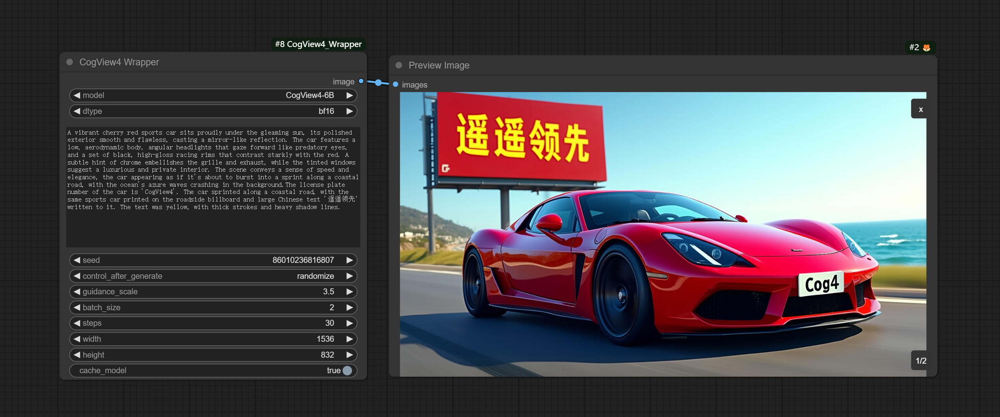

# ComfyUI_CogView4_Wrapper


The unofficial implementation of [CogView4](https://github.com/THUDM/CogView4) project in ComfyUI.    
Recommended to run on Nvidia GPU with VRAM of 16GB or more.


### Install
Open the cmd window in the plugin directory of ComfyUI, like ```ComfyUI\custom_nodes```，type  
```
git clone https://github.com/chflame163/ComfyUI_CogView4_Wrapper.git
```
Install dependency packages：
```
pip install -r ComfyUI_CogView4_Wrapper/requirements.txt
```

The model will be automatically downloaded to the ```ComfyUI/models/CogView``` directory during the first run.

## Note
ComfyUI_CgView4-Wrapper requires the installation of the diffusers dependency package in dev version, which may affect certain plugins. Please be aware of backing up the environment.
    

## statement
This nodes follows the MIT license, Some of its functional code comes from other open-source projects. Thanks to the original author. If used for commercial purposes, please refer to the original project license to authorization agreement.